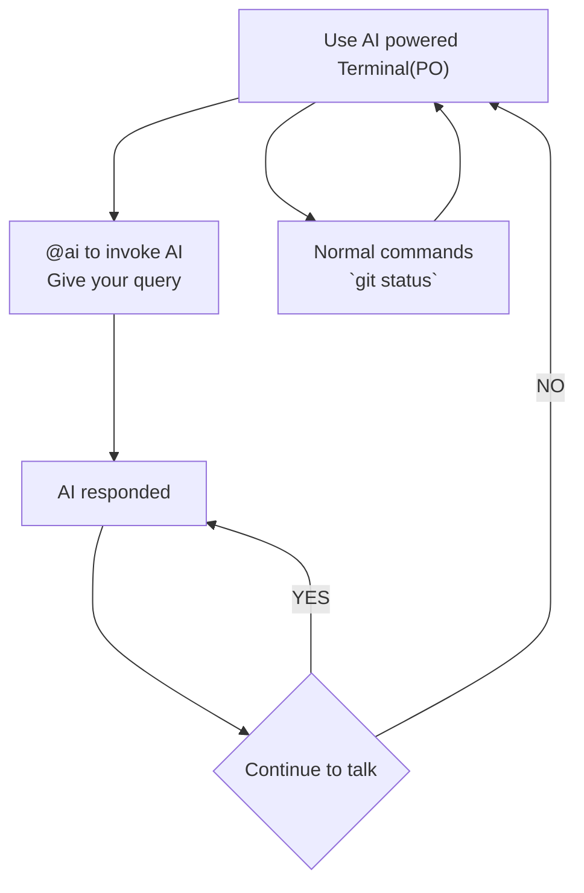

# PO — AI Buddy

Below is a high-level diagram of `PO` architecture

```mermaid
flowchart
A["Use AI powered Terminal(PO)"]
A ---> B["@ai to invoke AI<br/>Give your query"]
B ---> C["AI responded"]
C ---> D{"Continue to talk"}
D ---> |"YES"| C
D ---> |"NO"| A
A ---> G["Normal commands<br/>`git status`"]
G ---> A
```

