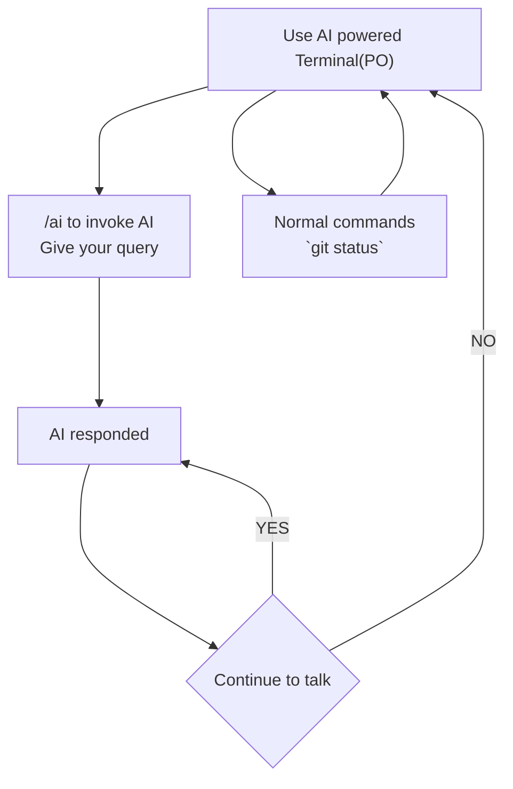

# AI powered Terminal

Termianl with AI integration, 
you can just stop your AI
OR Told something to AI


Config File path:

config file also contains the API key.

CONFIG_FILE_NAME = ".po.json"

Global level config(default):

### Windows
`Path.home() / "AppData" / "Roaming" / "po" `

### Linux/macOS
`Path.home() / ".config" / "po"`


> To invoke our AI/Program, use `PO` keyword

### How it works?

When user invoke our Program via `PO` this will start a REPL with context memory that will be discarded when user want.
    

Notes: 
1. Before executing the cmd, program will show the cmd and ask for permission
2. AI will/can/may be in loop when **prompted**, this mean if AI is processing something, it will keep it in its context until not completed. Like:
```bash
$ PO "can you push it" # AI got invoked, keep context of talk
$ AI: Here is cmd for push to remote origin main
    $ git push origin main
    Press y to execute it, n for exit this prompt-loop, or wirte your query: 
$ No I do not want to push on origin, what are my remotes?
$ AI: Oh, I get it, to see your remote, here its cmd
    $ git remote -v
    Press y to execute it, n for exit this prompt-loop, or wirte your query: 
$ y
$ git remote -v  # pasted by program
$ origin  https://github.com/<usrename>/<repo-name>.git (fetch)
$ origin  https://github.com/<usrename>/<repo-name>.git (push)
$ # Below step may be implemented
$ AI: Now what I need to do?
    Press y to execute it, n for exit this prompt-loop, or wirte your query: 
$ n # AI exited, all loop context gone
```


---


## Example:

    ```bash
    $ PO "can you push it" # AI got invoked, keep context of talk
    $ AI: Here is cmd for push to remote origin main
        $ git push origin main
        Press y to execute it, n for exit this prompt-loop, or wirte your query: 
    $ No I do not want to push on origin, what are my remotes?
    $ AI: Oh, I get it, to see your remote, here its cmd
        $ git remote -v
        Press y to execute it, n for exit this prompt-loop, or wirte your query: 
    $ y
    $ git remote -v  # pasted by program
    $ origin  https://github.com/<usrename>/<repo-name>.git (fetch)
    $ origin  https://github.com/<usrename>/<repo-name>.git (push)
    $ # Below step may be implemented
    $ AI: Now what I need to do?
        Press y to execute it, n for exit this prompt-loop, or wirte your query: 
    $ n # AI exited, all loop context gone
    ```

    - exit


Instrutor

https://platform.deepseek.com/





Environment Variables for API Keys:
Linux/MacOS:
```bash
export API_KEY_NAME=<your-api-key-here>
```

Windows:
```bash
setx DEEPSEEK_API_KEY "your-api-key-here"
```

Variables Names:
- DEEPSEEK_API_KEY
- TOGETHER_API_KEY
- GROQ_API_KEY

